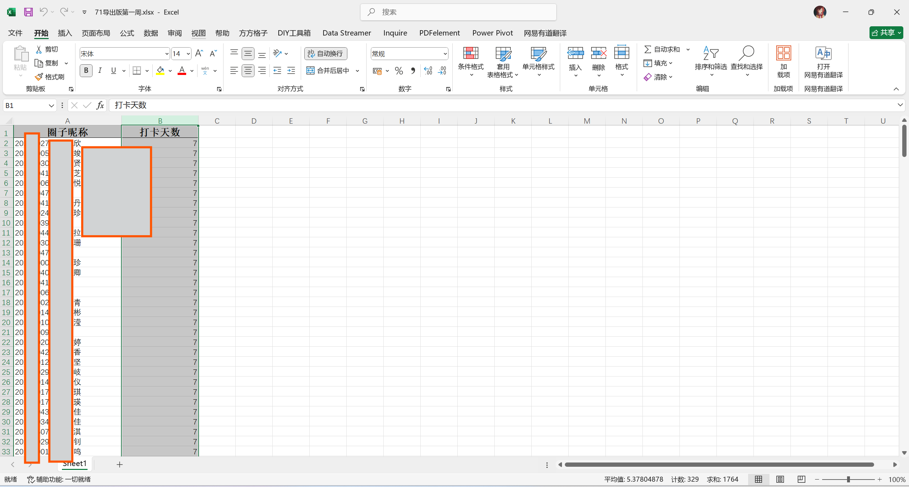

# 单词打卡二档积分整合程序使用

1. 预处理每一个项目的excel文件，并对文件的格式进行统一，具体细则如下：

   * 文件名请修改为`[积分档位名称].xlsx`

     在本例中，有两个积分档位，分别为30-70个（得一分），71个以上（得两分）。因此数据的excel文件名分别定为：`3070.xlsx`、`71.xlsx`

   * excel表格只有两列，第一列标题为`圈子昵称`，内容格式为`学号 + 姓名`；第二列标题为`打卡天数`（程序将根据不同档位的天数计算积分），内容格式为整形积分数值，如下图所示：

     

2. 将两个`xlsx`文件放入本程序所在的文件夹中，方便查找，如图：

3. 启动`单词打卡不同积分整合.exe`，依照程序弹窗左上角标题指引依次选择得分为1分、得分为2分的打卡数据

3. 完成两个数据的导入后程序将自动处理整合分数，成功后会有如下提示。本程序所在文件夹中的`单词打卡积分表01.xlsx`即为导出结果

