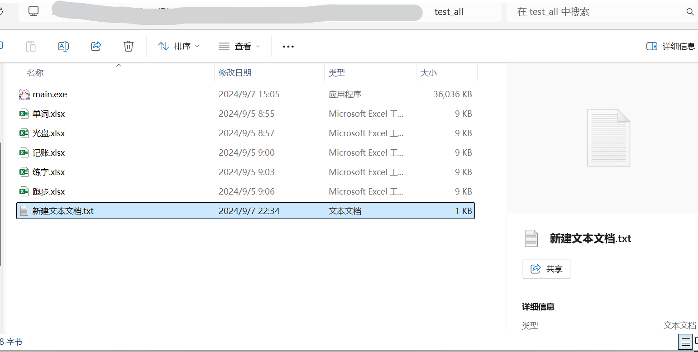
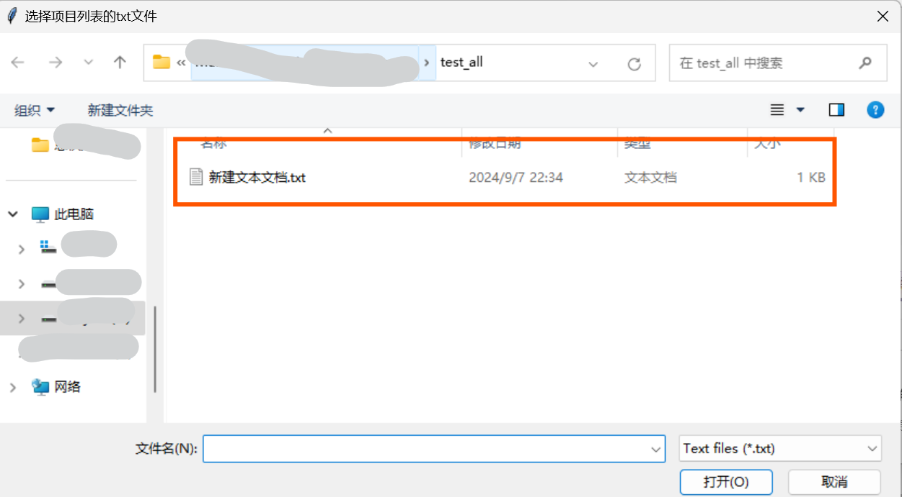

# 总积分表整合程序使用方法

1. 预处理每一个项目的excel文件，并对文件格式进行统一，具体细则如下：

* 文件名请修改为`[打卡项目名称].xlsx`

  在本例中，有五个打卡项目，分别为单词打卡、光盘打卡、记账打卡、跑步打卡和练字打卡。因此这五个项目数据的excel文件名分别定为：`单词.xlsx`、`光盘.xlsx`、`记账.xlsx`、`跑步.xlsx`、`练字.xlsx`

* excel表格只有两列，第一列标题为`圈子昵称`，内容格式为`学号 + 姓名`；第二列标题为`积分`，内容格式为整形积分数值，如下图所示：

  

2. 新建一个txt文本文档，里面输入所有的项目名称，每一个项目占一行，一个项目名称输入完成后回车再输入下一个项目（编辑完成后建议放到本程序所在的文件夹）。在本例中，有五个打卡项目，因此应该按照下图方式输入：

   

3. 将所有项目得分数据的excel文件放到本程序所在的文件夹，如下图所示：

   

4. 打开`总积分表整合程序.exe`，打开后会让你选择项目列表的txt文件，选择步骤2编辑过项目的txt文件。当读取成功后程序将自动完成处理

5. 当显示处理完成时，前往程序所在文件夹找到`总积分表.xlsx`即为整合后的总积分表

