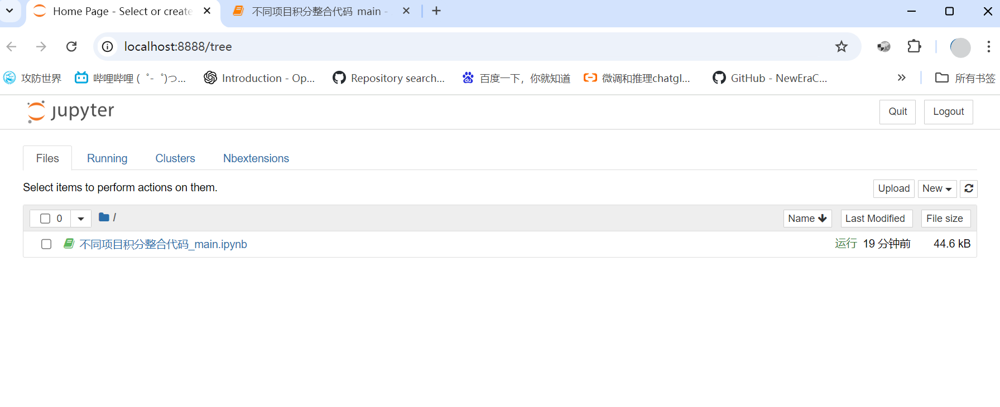
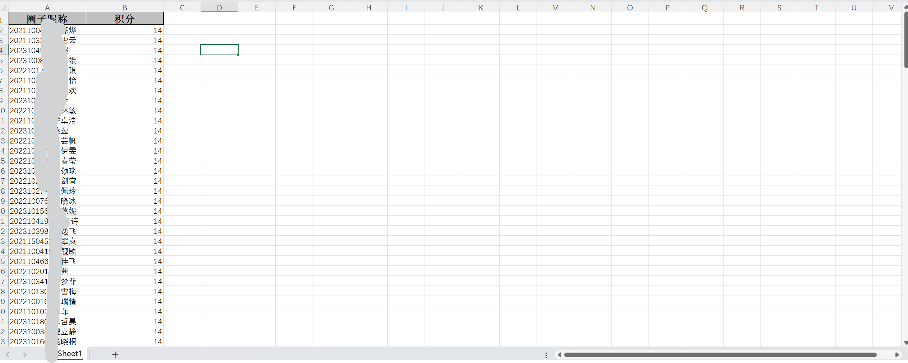
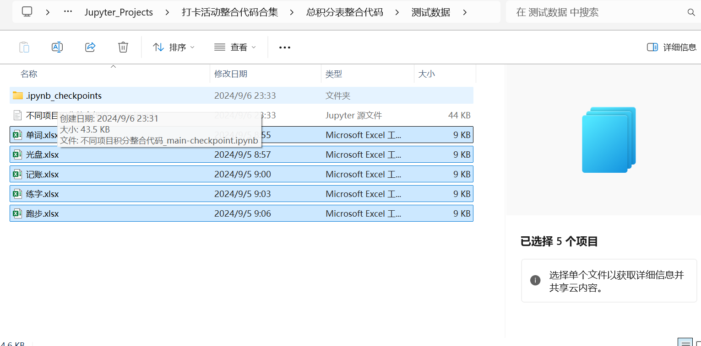
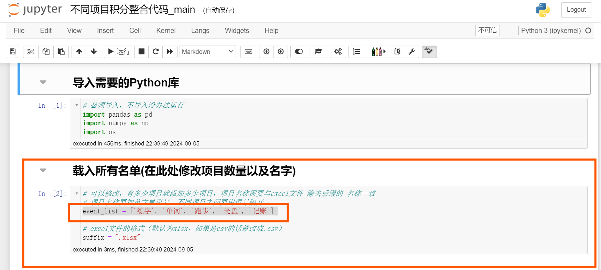
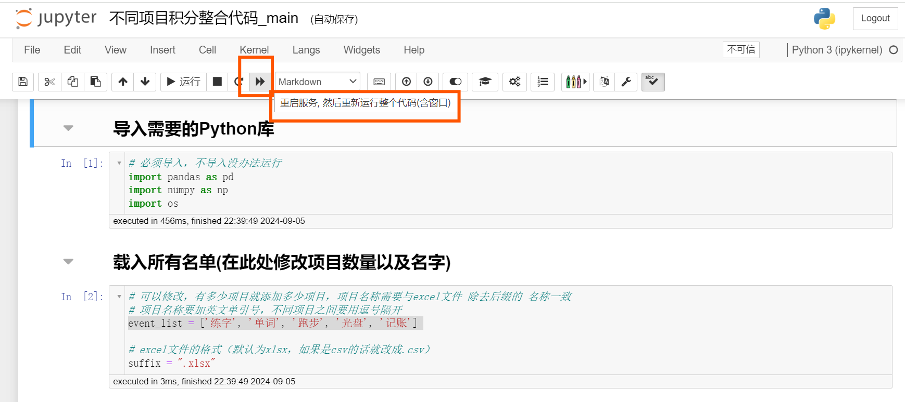

# 使用方法（Python配置以及jupyter安装略）

## 一、如何打开jupyter文件？

1. 进入文件夹页面，点击上面地址空白处。

2. 此时该文件夹路径被选中，然后直接输入`jupyter notebook`回车后即可打开。

3. 打开后打开`不同项目积分整合代码_main.ipynb`文件

## 二、如何操作将不同项目的积分整合到一个表并计算总积分？

1. 预处理每一个项目的excel文件，并对文件的格式进行统一，具体细则如下：

   * 文件名请修改为`[打卡项目名称].xlsx`

     在本例中，有五个打卡项目，分别为单词打卡、光盘打卡、记账打卡、跑步打卡和练字打卡。因此这五个项目数据的excel文件名分别定为：`单词.xlsx`、`光盘.xlsx`、`记账.xlsx`、`跑步.xlsx`、`练字.xlsx`

   * excel表格只有两列，第一列标题为`圈子昵称`，内容格式为`学号 + 姓名`；第二列标题为`积分`，内容格式为整形积分数值，如下图所示：

2. 将预处理完成的全部excel文件放入`不同项目积分整合代码_main.ipynb`所在的文件夹中

3. 在jupyter notebook上编辑`不同项目积分整合代码_main.ipynb`中`载入所有名单(在此处修改项目数量以及名字)`下面代码块的数组`event_list`

   请注意：

   * 中括号里面的为各项目excel的文件名（不带后缀）

   * 每个项目名要用英文单引号框柱

   * 项目名之间用英文逗号分开（最后一个项目不用）

   * 有几个项目填几个项目，代码将自动识别处理

   * 在本例中有五个项目，故输入为`event_list = ['练字', '单词', '跑步', '光盘', '记账'] `

     

4. 点击jupyter notebook上方菜单栏的重启服务，重新运行全部代码块，代码随即开始运行，所有代码完成后在代码所在的文件夹路径找到`总积分表.xlsx`，即为处理好的总积分表

