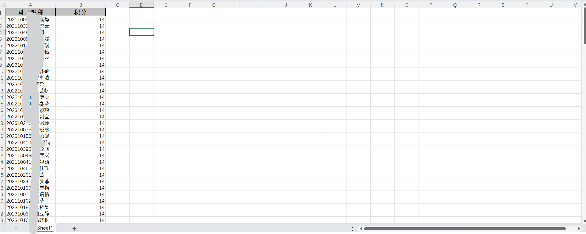
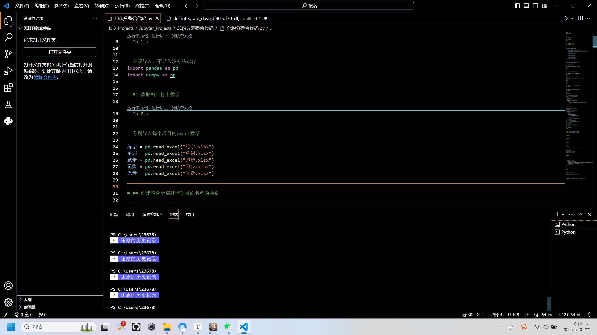
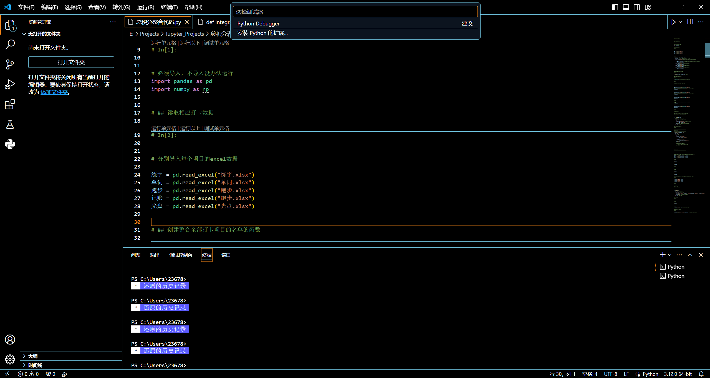
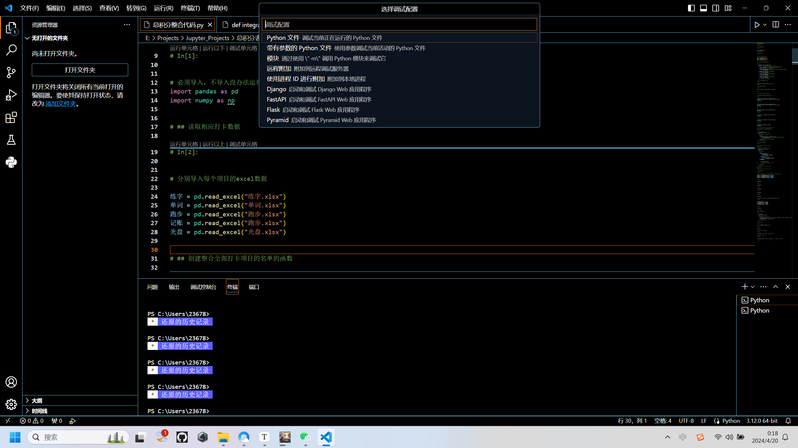
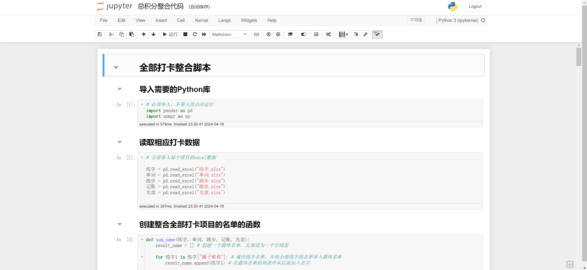
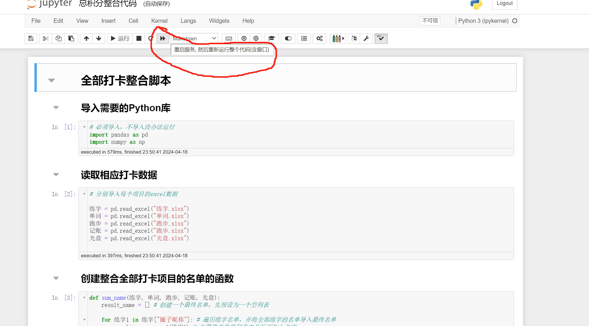

# 总积分表整合代码使用须知

## 一、Python环境配置以及IDE安装阶段（已有可跳）

* 按照https://www.runoob.com/python3/python3-install.html配置Python环境
* 按照https://www.runoob.com/python3/python-vscode-setup.html配置VScode的IDE
* 如果你拥有并且会使用Jupyter，那推荐你使用Jupyter，在代码运行时更加直观，发生错误时可以较快看到哪里出问题了

## 二、代码运行所需要安装的库

* 需要的库为pandas、numpy、openpyxl
* 安装方法如下：
  * 点击你电脑开始键中的搜索栏
  * 在搜索栏中输入cmd，并以管理员身份运行
  * 然后依次输入`pip install pandas`、`pip install numpy`、`pip install openpyxl`，分别等待其安装完毕即可

# 三、代码的使用（VScode）

* 预处理每一个项目的excel文件，并对文件的格式进行统一，具体细则如下：

  * 文件名分别为：`单词.xlsx`、`光盘.xlsx`、`记账.xlsx`、`跑步.xlsx`、`练字.xlsx`，顾名思义，对应五个打卡项目

  * excel表格只有两列，第一列标题为`圈子昵称`，内容格式为`学号 + 姓名`；第二列标题为`积分`，内容格式为整形积分数值，如下图所示：

    

* 用VScode打开`总积分整合代码.py`，保证图中

  `练字 = pd.read_excel("练字.xlsx")`

  `单词 = pd.read_excel("单词.xlsx")`

  `跑步 = pd.read_excel("跑步.xlsx")`

  `记账 = pd.read_excel("跑步.xlsx")`

  `光盘 = pd.read_excel("光盘.xlsx")`

  中`pd.read_excel()`函数的参数为对应的打卡项目的excel表格文件

* 然后你就可以开始运行代码了！不过在此之前，强烈推荐你以调试的模式运行代码，这样可以避免读取文件找不到的问题（似乎直接运行需要每个excel表格的绝对路径？如果你会解决当我没说）。所以，按F5启动调试模式，此时VScode中间最顶部的搜索栏会让你选择调试器，选择第一行的`Python Debugger`

  

  然后回让你选择调试配置，选择第一行`Python文件`

  

  然后调试模式将成功启动，代码将会运行并在运行结束之后生成一个`总积分表.xlsx`的文件，这就是经过代码处理后得到的总积分表，然后我们再根据要求对其格式手动微调即可。

# 四、代码的使用（Jupyter Notebook）

* Jupyter Notebook的配置过程较为麻烦，请善用搜索引擎完成配置，这里不再赘述

* 对五个excel文件的预处理要求同上

* Jupyter Notebook的优势在于你能更加直观地看到代码的分层、之间的联系、以及处理积分表时产生的中间数据，方便在发生错误时快速定位到有问题的代码块

  

* 下面将介绍如何使用：

  * 保证代码中

    `练字 = pd.read_excel("练字.xlsx")`

    `单词 = pd.read_excel("单词.xlsx")`

    `跑步 = pd.read_excel("跑步.xlsx")`

    `记账 = pd.read_excel("跑步.xlsx")`

    `光盘 = pd.read_excel("光盘.xlsx")`

    中`pd.read_excel()`函数的参数为对应的打卡项目的excel表格文件（同VScode）

  * 点击`重启服务，并重新运行整个代码`（如图），等待所有代码块执行完毕即可得到和上面相同的结果

    
